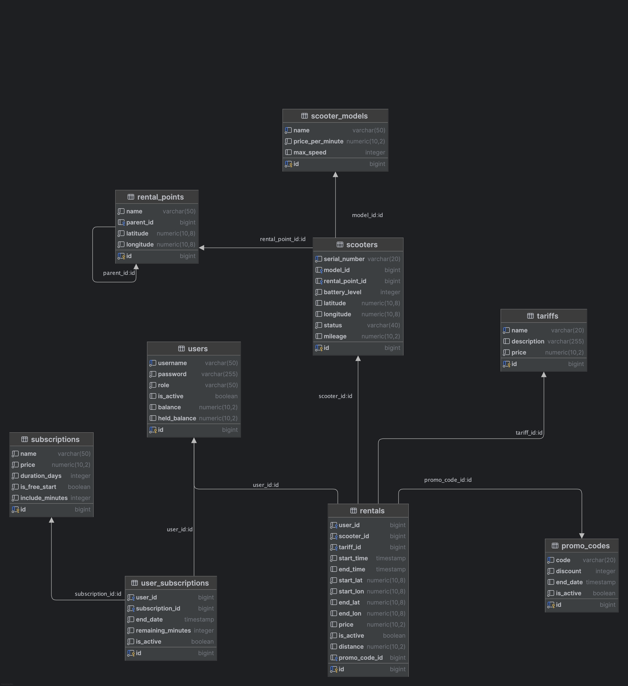

# Scooter Rental System 🛴


Веб-приложение для управления системой проката самокатов. Поддерживает иерархию точек проката, гибкую тарификацию (почасовая/абонементная), систему промокодов и детальную статистику для администраторов.

##  Основной функционал

**Для пользователей:**
* Регистрация и JWT-аутентификация.
* Пополнение виртуального баланса.
* Покупка абонементов (подписок) для бесплатного старта или минут.
* Старт и завершение аренды самоката с автоматическим расчетом стоимости по координатам и тарифу.
* Просмотр личной истории поездок.

**Для администраторов (Role: ADMIN):**
* Управление парком самокатов и моделями.
* Создание и редактирование точек проката (Rental Points).
* Настройка тарифов и генерация промокодов.
* Просмотр детальной статистики (доходы, популярные точки, история любого самоката).

---

##  Технологический стек

*   **Java 17**
*   **Spring Boot 4.0.5**
*   **Spring Security & JWT** (авторизация и аутентификация)
*   **Spring Data JPA** (работа с БД)
*   **PostgreSQL** (основная БД)
*   **Liquibase** (миграции БД)
*   **MapStruct** (маппинг Entity <-> DTO)
*   **Lombok** (генерация кода)
*   **Swagger / OpenAPI 3** (документация API)
*   **Docker & Docker Compose** (контейнеризация)
*   **JUnit 5 & Mockito** (Unit-тесты)
*   **Testcontainers** (Интеграционные тесты)

---

##  Предварительные требования

Перед установкой убедитесь, что у вас установлены:
1.  **JDK 17** или выше.
2.  **Maven 3.8+**.
3.  **Docker** и **Docker Compose**.

---

##  Быстрый запуск (Docker)

Самый быстрый способ запустить приложение вместе с базой данных:
  ```bash
    docker-compose up --build
  ```


Приложение будет доступно по адресу: `http://localhost:8080`

---

##  Локальная разработка (без Docker для приложения)

Если вы хотите запустить приложение локально, а базу данных в Docker:

1.  **Запустите только базу данных:**
    ```bash
    docker-compose up -d postgres
    ```

2.  **Настройте `src/main/resources/application.yaml`** (при необходимости измените параметры подключения к БД).

3.  **Запустите приложение:**
    ```bash
    mvn spring-boot:run
    ```
---

##  Документация API

После запуска приложения интерактивная документация Swagger доступна по адресу:
`http://localhost:8080/swagger-ui/index.html`

Здесь вы можете протестировать все эндпоинты, включая регистрацию, покупку абонементов и начало аренды.

---

##  Доступы по умолчанию

При первом запуске Liquibase создает администратора:
*   **Username:** `admin`
*   **Password:** `admin123`

Для доступа к защищенным методам необходимо:
1.  Выполнить POST запрос к `/api/auth/login`.
2.  Получить JWT токен.
3.  Использовать его в заголовке `Authorization: Bearer <token>`.

---

## 🚶‍♂️ Пример работы с API (Сценарий аренды)

1. **Регистрация:** `POST /api/auth/register` (создаем аккаунт).
2. **Логин:** `POST /api/auth/login` (получаем токен).
3. **Пополнение баланса:** `POST /api/users/me/balance` (закидываем деньги).
4. **Поиск самокатов:** `GET /api/scooters/available?pointId=1` (ищем свободный транспорт на точке).
5. **Старт аренды:** `POST /api/rentals/start` (передаем ID самоката и тарифа).
6. **Завершение:** `POST /api/rentals/{id}/finish` (передаем конечные координаты, списываются деньги).

---

## 🗄 Архитектура базы данных
Схема взаимодействия основных сущностей (Пользователи, Самокаты, Точки проката, Аренды, Подписки):



---

##  Тестирование

Проект содержит Unit-тесты и интеграционные тесты (с использованием Testcontainers).

**Запуск всех тестов:**
  ```bash
  mvn test
  ```

---

##  Структура проекта

*   `src/main/java/org/example/controller` — REST-контроллеры.
*   `src/main/java/org/example/service` — Бизнес-логика.
*   `src/main/java/org/example/repository` — Слой доступа к данным (DAO).
*   `src/main/java/org/example/entity` — Сущности БД.
*   `src/main/java/org/example/dto` — Объекты передачи данных.
*   `src/main/resources/db/changeset` — Скрипты миграции Liquibase.

---

## ️ Конфигурация

Основные настройки находятся в `application.yaml`:
*   `spring.datasource` — подключение к БД.
*   `jwt.secret` — ключ для подписи токенов.
*   `jwt.expiration` — время жизни токена (в мс).